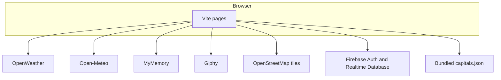
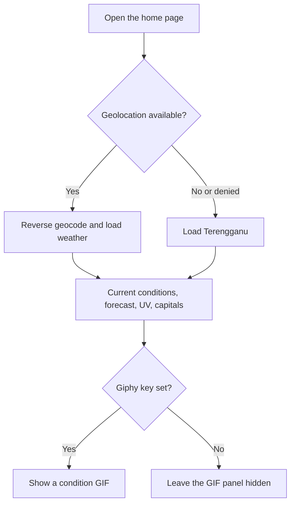
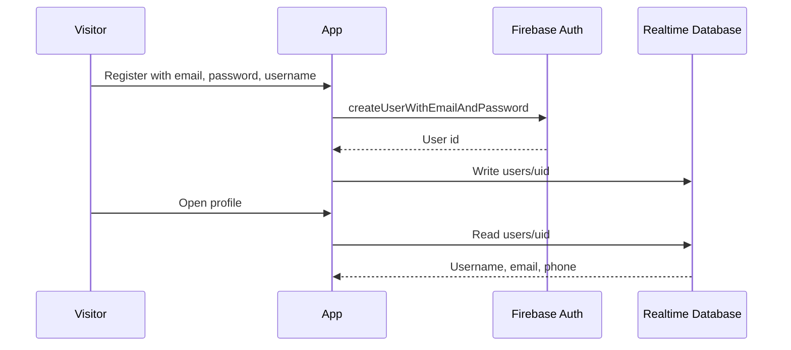
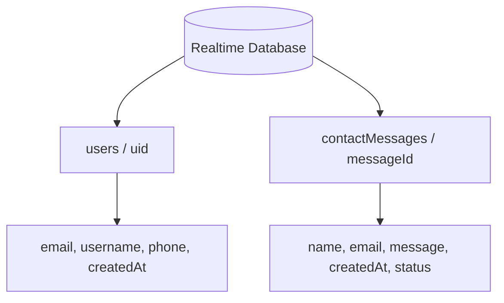

# Weather Hub

> A browser-only weather dashboard: current conditions, forecasts, an interactive map, and six languages, hosted on the Firebase Spark plan.

[](https://weather-hub-5ccbb.web.app)
[](package.json)
[](https://nodejs.org/)
[](https://vitejs.dev/)
[](https://firebase.google.com/)
[](https://leafletjs.com/)

Weather Hub is a static site. The browser calls each weather, map, and translation provider directly, which is what lets the app run on the Firebase **Spark (free)** plan, where Cloud Functions are unavailable. No credit card is required for any service the running app uses.

**Hosting:** [weather-hub-5ccbb.web.app](https://weather-hub-5ccbb.web.app) · [weather-hub-5ccbb.firebaseapp.com](https://weather-hub-5ccbb.firebaseapp.com)

**Repository:** [github.com/Fagacie/Weather-Hub](https://github.com/Fagacie/Weather-Hub)

---

## Overview

The home page loads weather for the visitor's location, with Terengganu as the fallback when geolocation is unavailable. From there a visitor can scan a 24-hour and 5-day forecast, browse weather for 245 bundled world capitals, open a place on a Leaflet map, switch language, and optionally sign in to keep a profile.

Accounts, profiles, and the contact form are the only features that talk to Firebase. Weather data never passes through a server you operate.

## Pages

| Page | File | What it does |
| --- | --- | --- |
| Home | `index.html` | Current conditions, forecast tabs, advisories, capitals list, optional weather GIF, light/dark theme |
| Map | `map.html` | OpenStreetMap tiles, place search, click-to-inspect weather popup |
| Login | `login.html` | Email and password sign-in |
| Register | `register.html` | Account creation and profile write |
| Profile | `profile.html` | View and edit username and phone; sign out |
| About | `about.html` | Short introduction and contact form |
| Not found | `404.html` | Unknown-route page |

Profile is available from the account menu after sign-in. The Login link is hidden once a session exists.

## Key features

| Feature | What you get |
| --- | --- |
| Current weather | Location name, temperature, description, feels-like, wind, rain chance, and UV index |
| Forecast | Next eight 3-hour slots (24 hours) and up to five daily rows from the OpenWeather 5-day forecast |
| Advisories | Client-side notices for thunderstorms, heat at or above 38°C, cold at or below −5°C, and wind at or above 15 m/s |
| World capitals | Searchable, paged list of 245 capitals from `src/data/capitals.json` |
| Interactive map | Pan and click for a weather popup, or search places with Open-Meteo geocoding. Deep links accept `lat`, `lon`, and `name` |
| Weather GIF | Optional Giphy clip for the current condition. Hidden when no key is set |
| Languages | English, Arabic, Malay, Tamil, Hindi, and Simplified Chinese. Arabic sets the document to right-to-left |
| Theme | Light and dark mode on the home page, stored in `localStorage` |
| Accounts | Email/password auth, a per-user profile, and sign-out |
| Contact | About-page form that creates a message the browser cannot read back |

## Preview

The repository does not include screenshots or a demo recording yet. Add captures at the paths below and they can replace this note.

> **Screenshot placeholders**
>
> | Home dashboard | Map |
> | --- | --- |
> | `docs/images/home.png` | `docs/images/map.png` |
>
> | Capitals and forecast | Arabic (RTL) |
> | --- | --- |
> | `docs/images/forecast.png` | `docs/images/arabic.png` |
>
> **Suggested recording:** `docs/assets/demo.gif` — open the home page, allow location, switch to Arabic, then search a capital and open it on the map.

## Architecture

There is no application backend in the deployed site. Vite builds static pages into `dist/`, Firebase Hosting serves them, and the browser talks to public APIs and to Firebase Auth and Realtime Database.



| Concern | Where it lives |
| --- | --- |
| UI | Multi-page HTML in the repo root, page scripts in `src/pages/`, styles in `src/styles/main.css` |
| Data access | `src/js/api.js` and `src/js/providers/` |
| Auth and profiles | Firebase Auth plus Realtime Database |
| Contact messages | Direct writes to `contactMessages` |
| Country data | Bundled JSON, regenerated by `scripts/build-capitals.mjs` |
| Hosting | Firebase Hosting, public directory `dist` |
| Keys | `VITE_*` values inlined into the client bundle at build time |

### Why the browser calls providers directly

Google Maps and Google Cloud Translation both require a billing account, even inside their free tiers. Firebase Cloud Functions require the Blaze plan for the same reason. Leaflet, Open-Meteo, and MyMemory remove that card requirement.

The trade-off is that the OpenWeather key ships in the client bundle, because there is no server to hide it behind. That is acceptable for a free-tier OpenWeather key, which cannot generate charges. The worst case is that someone consumes the rate limit, and you rotate the key. Keep any key that can incur costs out of this project.

`functions/` is an earlier Cloud Functions backend. `firebase.json` does not reference it, and it is not deployed. It remains as a starting point if you later move to the Blaze plan and want server-side key handling. Those routes (`/health`, `/config/public`, `/contact`, `/weather`, `/forecast`, `/uv`, `/reverse-geocode`, `/translate`) are unused by the current frontend.

## How a visit works



The map opens on `[5.3302, 103.1408]` unless the URL already contains coordinates. A click or a search result drops a marker and requests current weather for that point.

### Sign-in



Weather pages work without an account. Profile redirects to `login.html` when there is no session.

### Language

OpenWeather is asked for descriptions in the selected language when it has one: English, Arabic, Hindi, and Simplified Chinese (`zh_cn`). Malay and Tamil are requested in English, then translated with MyMemory.

MyMemory's free tier is metered in words per day and accepts one string per request. Translations are cached in `sessionStorage` and fetched with a concurrency limit of 4. Switching back to a language already used in the session does not spend more quota. The language choice itself is stored in `localStorage` under `weatherhub:lang`.

## Tech stack

| Layer | Technology |
| --- | --- |
| UI | HTML, CSS, Bootstrap Icons (CDN) |
| Bundler | Vite 6 |
| Maps | Leaflet 1.9, OpenStreetMap tiles |
| Weather | OpenWeather free tier: current conditions, 5-day forecast, reverse geocoding |
| UV index | Open-Meteo forecast API |
| Place search | Open-Meteo Geocoding |
| Translation | MyMemory |
| Optional GIF | Giphy Search API, `rating=g` |
| Auth and data | Firebase JS SDK 11 (compat): Auth and Realtime Database |
| Hosting | Firebase Hosting on the Spark plan |
| CI | GitHub Actions: preview on pull request, deploy on push to `master` |

Runtime dependencies are `firebase` and `leaflet`. Vite is the only dev dependency.

## Providers

| Feature | Provider | Key | Card |
| --- | --- | --- | --- |
| Current weather, 5-day forecast, reverse geocoding | OpenWeather free tier | Yes | No |
| UV index | Open-Meteo | No | No |
| Map tiles | OpenStreetMap via Leaflet | No | No |
| Place search | Open-Meteo Geocoding | No | No |
| Translation | MyMemory | No | No |
| Weather GIF | Giphy beta key | Optional | No |
| Country and capital data | Bundled `src/data/capitals.json` | No | No |
| Auth, profiles, contact messages | Firebase Spark | Yes | No |

### Giphy quota

The home page can show a GIF for the current condition. With no `VITE_GIPHY_API_KEY`, that panel stays hidden and nothing else changes.

Create a free beta key at [developers.giphy.com/dashboard](https://developers.giphy.com/dashboard/) and choose the API option. It works immediately and needs no credit card. Beta keys are limited to **100 calls per hour**.

The lookup is keyed on the OpenWeather condition, cached in `localStorage` for 24 hours. The capitals list and the forecast tiles use OpenWeather icons and never call Giphy. Every request sends `rating=g`.

### OpenWeather key activation

1. Sign up at [home.openweathermap.org/users/sign_up](https://home.openweathermap.org/users/sign_up) with an email.
2. Confirm the verification email.
3. Copy the key from [home.openweathermap.org/api_keys](https://home.openweathermap.org/api_keys).

New keys take **10 minutes to 2 hours** to activate. Until then every request returns HTTP 401. The app reports that explicitly.

## Rate limits

| Provider | Limit |
| --- | --- |
| OpenWeather free | 60 calls/minute, 1,000,000 calls/month |
| Open-Meteo | About 10,000 calls/day, non-commercial use |
| MyMemory | 5,000 words/day per IP anonymously |
| Giphy beta key | 100 calls/hour, reduced by 24-hour condition caching |
| OpenStreetMap tiles | Fair-use policy; heavy traffic needs your own tile host |

## Project structure

```text
Weather-Hub/
├── index.html              Home
├── map.html                Map
├── login.html              Sign in
├── register.html           Create account
├── profile.html            Profile
├── about.html              About and contact
├── 404.html
├── vite.config.js          Multi-page build
├── firebase.json           Hosting, database rules, emulator ports
├── database.rules.json
├── .firebaserc             Project weather-hub-5ccbb
├── .env.example
├── src/
│   ├── data/capitals.json
│   ├── pages/              One entry module per page
│   ├── styles/main.css
│   └── js/
│       ├── api.js          Provider and contact entry point
│       ├── auth.js
│       ├── weather.js
│       ├── map.js
│       ├── translate.js
│       ├── i18n.js
│       ├── firebase-config.js
│       ├── providers/      openweather, openMeteo, myMemory, giphy
│       └── components/nav.js
├── scripts/
│   ├── api-smoke-test.mjs
│   └── build-capitals.mjs
├── functions/              Earlier backend, not deployed
└── .github/workflows/      Hosting preview and production deploy
```

## Database

Engine: **Firebase Realtime Database**. Rules live in `database.rules.json`.



| Path | Access | Validation |
| --- | --- | --- |
| `users/$uid` | Read and write only when `auth.uid` matches `$uid` | Requires `email` and `username`. Username length 1–50. Email must match a simple address pattern |
| `contactMessages/$messageId` | Create only. Read is denied for the whole node | Requires `name`, `email`, `message`, `createdAt`, and `status`. `status` must be `new`. Name ≤ 100, email ≤ 254, message ≤ 2000. Updates and deletes are rejected |

The browser writes contact messages with `status: "new"`. It cannot list, edit, or delete them.

## Security

- Each signed-in user can read and write only `users/$uid`.
- `contactMessages` is write-only and create-only. Rules check email format and length caps.
- `.env.local` is gitignored. Any `VITE_` variable is embedded in the public bundle at build time.
- Use a free-tier OpenWeather key. A key that can bill you does not belong in this client.

## Prerequisites

- Node.js 20 or newer
- A Firebase project with Email/Password authentication and Realtime Database enabled
- A free OpenWeather API key
- Firebase CLI, only when you deploy (`npm install -g firebase-tools`)

The checked-in client config points at project `weather-hub-5ccbb`. To use another project, override the `VITE_FIREBASE_*` variables or replace `src/js/firebase-config.js`.

In the Firebase console for that project:

- Enable **Email/Password** under Authentication → Sign-in method.
- Add your dev and hosting domains under Authentication → Settings → Authorized domains.
- Create a Realtime Database and deploy `database.rules.json`.

## Installation

```bash
git clone https://github.com/Fagacie/Weather-Hub.git
cd Weather-Hub
npm install
```

Create a local env file and set at least the OpenWeather key:

```bash
# macOS / Linux
cp .env.example .env.local

# Windows PowerShell
Copy-Item .env.example .env.local
```

## Configuration

| Variable | Required | Purpose |
| --- | --- | --- |
| `VITE_OPENWEATHER_API_KEY` | Yes | OpenWeather current weather, forecast, and reverse geocoding |
| `VITE_GIPHY_API_KEY` | No | Weather GIF. Omit it to hide the panel |
| `VITE_FIREBASE_API_KEY` | No | Overrides `src/js/firebase-config.js` when set |
| `VITE_FIREBASE_AUTH_DOMAIN` | No | Same |
| `VITE_FIREBASE_DATABASE_URL` | No | Same |
| `VITE_FIREBASE_PROJECT_ID` | No | Same |
| `VITE_FIREBASE_STORAGE_BUCKET` | No | Same |
| `VITE_FIREBASE_MESSAGING_SENDER_ID` | No | Same |
| `VITE_FIREBASE_APP_ID` | No | Same |
| `VITE_FIREBASE_MEASUREMENT_ID` | No | Same |

Leave the Firebase variables blank to keep the defaults in `src/js/firebase-config.js`.

## Usage

Start the dev server:

```bash
npm run dev
```

Vite prints a local URL, port **5173** by default. Allow location access to load weather for where you are. If you deny it, the dashboard falls back to Terengganu.

Then:

1. Read current conditions and switch the **Now**, **24-hour**, and **5-day** tabs.
2. Search the capitals list, or open **Map**, search a place, and click the map.
3. Change language from the nav select. Arabic flips the layout to RTL.
4. On the home page, toggle light and dark mode.
5. Register, sign in, and edit the profile. Submit the form on **About** to store a contact message.

Stop the dev server with `Ctrl+C`.

Serve the production build locally:

```bash
npm run build
npm run preview
```

`npm run test:api` calls the real provider endpoints and reports each one on its own. That is the fastest way to tell an inactive API key apart from an outage. Giphy is skipped, and the suite still passes, when its key is absent.

Refresh the capitals file when you want newer source data. It downloads the [mledoze/countries](https://github.com/mledoze/countries) dataset that the old unauthenticated restcountries API was built on:

```bash
node scripts/build-capitals.mjs
```

### Scripts

| Command | Purpose |
| --- | --- |
| `npm run dev` | Vite dev server with hot reload |
| `npm run build` | Production build into `dist/` |
| `npm run preview` | Serve the production build locally |
| `npm run test:api` | Check every external provider end to end |

## Deployment

Production hosting is Firebase project `weather-hub-5ccbb`.

```bash
npm run build
firebase deploy --only hosting,database
```

Only hosting and database rules are deployed. Both are available on the Spark plan. `firebase.json` also declares emulator ports (hosting `5000`, database `9000`, auth `9099`). The client does not connect to those emulators; it uses the configured Firebase project.

GitHub Actions:

| Workflow | When | What it does |
| --- | --- | --- |
| `.github/workflows/firebase-hosting-pull-request.yml` | Pull request | Builds and publishes a Hosting preview |
| `.github/workflows/firebase-hosting-merge.yml` | Push to `master` | Builds and deploys hosting and database rules |

Both workflows expect these repository secrets:

| Secret | Used for |
| --- | --- |
| `VITE_OPENWEATHER_API_KEY` | Build-time weather key |
| `VITE_GIPHY_API_KEY` | Build-time GIF key |
| `FIREBASE_SERVICE_ACCOUNT_WEATHER_HUB_5CCBB` | Firebase deploy credentials |

HTML is served with `Cache-Control: no-cache`. Hashed files under `/assets/` are cached for one year.

## Optional Blaze path

Moving API keys off the client means the Blaze plan, because Cloud Functions require billing. `functions/` already sketches that proxy: OpenWeather, Google Translate, and Google Maps keys as secrets, plus CORS limited to the Hosting origins and local Vite ports. The current app does not call it. Wiring it up is a later choice, and it brings back the card requirement this version was built to avoid.
